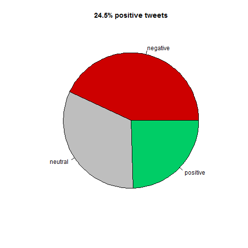

Sales Pitch for my Twitter Cloud
========================================================
author: Julian Oehling
date: 01 March 2017
autosize: true
transition: rotate
transition-speed: slow
font-family: 'Helvetica'

My airline tweet cloud
========================================================


- A visually pleasing word cloud
- Comes with a calculation of satisfaction levels
- Shiny is used to modify the parameters


Based on kaggle data
========================================================
left: 70%


```r
library(data.table)
```


```r
tweets <- fread(file = 
"E:/Coursera/DataProducts/airlinetweets/Tweets.csv")
summary(tweets)
```

```
    tweet_id          airline_sentiment  airline_sentiment_confidence
 Min.   :9.748e-271   Length:14640       Min.   :0.3350              
 1st Qu.:1.179e-270   Class :character   1st Qu.:0.6923              
 Median :1.372e-270   Mode  :character   Median :1.0000              
 Mean   :1.317e-270                      Mean   :0.9002              
 3rd Qu.:1.459e-270                      3rd Qu.:1.0000              
 Max.   :1.547e-270                      Max.   :1.0000              
                                                                     
 negativereason     negativereason_confidence   airline         
 Length:14640       Min.   :0.000             Length:14640      
 Class :character   1st Qu.:0.361             Class :character  
 Mode  :character   Median :0.671             Mode  :character  
                    Mean   :0.638                               
                    3rd Qu.:1.000                               
                    Max.   :1.000                               
                    NA's   :4118                                
 airline_sentiment_gold     name           negativereason_gold
 Length:14640           Length:14640       Length:14640       
 Class :character       Class :character   Class :character   
 Mode  :character       Mode  :character   Mode  :character   
                                                              
                                                              
                                                              
                                                              
 retweet_count          text           tweet_coord       
 Min.   : 0.00000   Length:14640       Length:14640      
 1st Qu.: 0.00000   Class :character   Class :character  
 Median : 0.00000   Mode  :character   Mode  :character  
 Mean   : 0.08265                                        
 3rd Qu.: 0.00000                                        
 Max.   :44.00000                                        
                                                         
 tweet_created      tweet_location     user_timezone     
 Length:14640       Length:14640       Length:14640      
 Class :character   Class :character   Class :character  
 Mode  :character   Mode  :character   Mode  :character  
                                                         
                                                         
                                                         
                                                         
```

***

Is uses 14640 tweets from a dataset found at https://www.kaggle.com/crowdflower/twitter-airline-sentiment.

By the way,the above statement uses inline R code. Isn't that cool?

Calculated satisfaction statistic
========================================================


```r
sent <- tweets$airline_sentiment[tweets$airline == "Delta"]
sent <- as.factor(sent)
res <- summary(sent)
pie(x = res ,labels = names(res), col =  c("red3", "grey", "springgreen3"), 
          main = paste(round(100* res[3] / sum(res[1:3]), digits = 1), "% positive tweets", sep=""))
```




Creates a nice pie chart with the percentage of satisfied tweets as title... hmmm, **pie** charts....:-)

Comes with a nice presentation
========================================================

>- It even has its very own sales pitch presentation thinghy
>- You are looking at it right now. :-)
>- The presentation uses funny slide transitions simply beacuse it can!  
  
## I hope you enjoyed it!
### Julian
